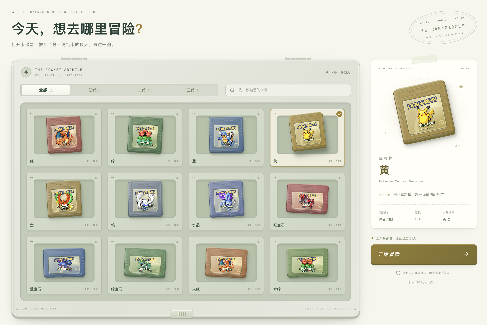

<p align="center">
  
</p>

<h1 align="center">Poké Pocket</h1>

<p align="center">在浏览器的卡带收藏盘中游玩 GB / GBC / GBA 宝可梦，保存各自的进度。</p>

<p align="center">
  <a href="https://pokepocket.hexly.ai">站点</a> ·
  <a href="docs/README.en.md">English</a>
</p>

<p align="center">
  
</p>

## 这是什么

Poké Pocket 是拟物卡带收藏盘与网页版掌机模拟器。React 实现卡带、掌机和操作面板，mGBA WebAssembly 在浏览器中执行用户自备的 ROM；Cloudflare Worker 负责访问验证与静态资源交付。

卡带盘覆盖红 / 绿 / 蓝 / 黄、金 / 银 / 水晶、红宝石 / 蓝宝石 / 绿宝石、火红 / 叶绿。当前支持 GB、GBC、GBA 单机游玩，不支持 NDS、3DS、Switch 或联机交换与对战。仓库与部署包不包含 ROM。

## 功能

- 按版本切换卡带配色、屏幕和掌机边框，通过文件选择或拖放导入卡带。
- 支持自定义键盘映射、触屏和标准 Gamepad API 手柄，检查键位冲突并保存设置。
- 暂停、临时快进、音量调节、全屏，提供清晰像素与复古液晶两种画面滤镜。
- 为每枚 ROM 保存游戏内电池存档、自动恢复点和三个手动即时存档，支持 `.sav` 导入与导出。
- 将游戏画面导出为 PNG 截图；加载、替换和清除即时存档前需确认。

ROM、存档与即时存档按 ROM 的 SHA-256 区分，保存在当前浏览器的 IndexedDB；键位和显示偏好保存在 localStorage。导入、模拟和截图在浏览器完成，不上传 ROM 或进度。换设备或清理浏览器数据前，请先在游戏内保存，再导出 `.sav`。

## 使用

[在线站点](https://pokepocket.hexly.ai) 需要 Cloudflare Access 授权。进入收藏盘后导入自己的 `.gb`、`.gbc` 或 `.gba` 文件，再选择对应卡带开始；之后可从同一浏览器的缓存继续。

| 启动方式                              | 卡带来源                                     |
| ------------------------------------- | -------------------------------------------- |
| `bun run dev`，存在 `roms/` 或 `rom/` | 自动发现本机私有目录中的卡带，也可浏览器导入 |
| `bun run dev`，没有本地卡带           | 浏览器导入与缓存                             |
| 生产站点 / `bun run preview`          | Access 验证后，从浏览器导入与缓存            |

开发服务器只扫描 `roms/`、`rom/` 第一层的 ROM 文件，按真实文件头识别版本，忽略无效文件和符号链接；开始或切换版本时才读取选中的卡带。生产与预览不读取这两个目录。

| 操作           | 默认键位         |
| -------------- | ---------------- |
| 方向           | 方向键 / W A S D |
| A / B          | O / P            |
| L / R          | Q / E            |
| START / SELECT | Enter / Shift    |
| 暂停           | Space            |
| 临时快进       | 按住反引号       |
| 静音 / 全屏    | M / F            |

返回卡带盘会暂停并保存；切换卡带时保留原进度。导入 `.sav` 会替换该 ROM 的电池存档并清除旧自动恢复点，保留三个手动即时存档。跨模拟器转移进度使用 `.sav`；即时存档依赖模拟器核心版本。

## 开发

需要 Node.js 22.12 或更新版本，推荐使用与 CI 一致的 Bun 1.4.0。安装时会准备未修改的 mGBA JavaScript / WASM 文件与运行依赖的许可证。

```bash
git clone https://github.com/nocoo/pokepocket.git
cd pokepocket
bun install --frozen-lockfile
bun run dev
```

开发服务器监听 `127.0.0.1:7047`，可访问 `http://localhost:7047`。仓库配置的本地域名是 `pokepocket.dev.hexly.ai`，使用它需要自行准备本机 DNS 与受信任 HTTPS 代理。模拟器线程需要 `SharedArrayBuffer`；开发服务器和 Worker 均提供 COOP / COEP 隔离响应头。

```bash
bun run typecheck
bun run lint
bun run build
bun run preview
```

预览端口为 17047，保留生产 Access 验证；缺少有效令牌时返回 403。日常本机游玩使用开发服务器。构建会检查静态资源和 Git 跟踪路径，阻止 ROM、存档进入分发包。

### 托管与访问

当前部署见 [wrangler.jsonc](wrangler.jsonc) 与 [Worker 入口](worker/index.ts)。页面、图片、WASM 和游戏 API 都经过 Worker 验证，`GET /api/live` 是唯一公开 API，仅返回状态和版本。生产 Worker 不提供 ROM 路由，没有服务端模拟、存档数据库或 ROM 存储。

Access 的 issuer 与团队校验在代码中固定为 `nocoo`，仅修改环境变量不能迁移到其他团队。自行托管需同步调整这些配置、域名与 Access audience，并为整个站点配置访问策略。`workers.dev` 和预览域名在当前配置中关闭。

| 目录                            | 内容                                   |
| ------------------------------- | -------------------------------------- |
| `src/components`、`src/App.tsx` | 卡带盘、掌机、存档与设置界面           |
| `src/lib`                       | 模拟器、输入映射、卡带识别与浏览器存储 |
| `src/data`                      | 支持版本目录                           |
| `worker`                        | Access 验证、API 与资源响应            |
| `scripts`、`tests`              | 开发工具与测试                         |

## 测试

| 测试层                                   | 命令                        |
| ---------------------------------------- | --------------------------- |
| 组件、模拟器封装、存储与 Worker 单元测试 | `bun run test`              |
| 本地卡带服务 HTTP 测试                   | `bun run test:http`         |
| 生产 Worker HTTP 合约测试                | `bun run quality:l2`        |
| 必需浏览器流程                           | `bun run test:e2e`          |
| 本机自备卡带的可选浏览器流程             | `bun run test:e2e:optional` |

`bun run test:coverage` 生成覆盖率报告。HTTP 合约命令会先构建应用并使用端口 17048；浏览器命令会构建并使用独立端口 27047，运行前确保相应端口空闲。

本地浏览器流程使用已安装的 Google Chrome；CI 使用 Playwright Chromium，可通过 `bunx playwright install --with-deps chromium` 准备。必需流程使用原创 GB / GBC / GBA 测试程序与临时签名令牌，不需要商业 ROM。可选流程需要本机完整的受支持卡带集合；这些测试不代替真实 Cloudflare SSO 登录验证或完整游戏通关。

## 技术栈


| 部分       | 实现                                             |
| ---------- | ------------------------------------------------ |
| 界面       | React、TypeScript、CSS、Lucide                   |
| 模拟器     | mGBA WebAssembly、Canvas、Web Audio、Gamepad API |
| 本地数据   | IndexedDB / idb、localStorage                    |
| 托管与认证 | Cloudflare Workers、Cloudflare Access、jose      |
| 开发与测试 | Vite、Bun、Vitest、Testing Library、Playwright   |

## 文档

- [文档索引](docs/README.md)
- [Logo 使用说明](docs/04-logo-usage.md)与[标识设计](https://hexly.ai/logos/pokepocket)
- [第三方来源与许可](THIRD_PARTY_NOTICES.md)，包含卡带参考源码与构建工具出处

架构和交互参考 [Swift-plays-Pokemon](https://github.com/LiarPrincess/Swift-plays-Pokemon) 与 [PokeSwift](https://github.com/Dimillian/PokeSwift)。本项目使用 mGBA 核心，没有移植它们的 Swift 模拟器实现。

## 许可证

原创应用代码与文档采用 [MIT](LICENSE) © 2026 Zheng Li。mGBA WebAssembly 保持未修改，采用 MPL-2.0；分发包附带许可证与对应源码地址，其他依赖保留各自许可证。

ROM、宝可梦名称、商标、角色素材和截图中的原作内容不在 MIT 授权范围内，相关权利归 Nintendo、Game Freak、Creatures 等权利人所有。本项目是独立爱好者作品，无官方关联或背书；项目许可和访问控制不授予游戏内容使用权。完整说明见 [THIRD_PARTY_NOTICES.md](THIRD_PARTY_NOTICES.md)。
